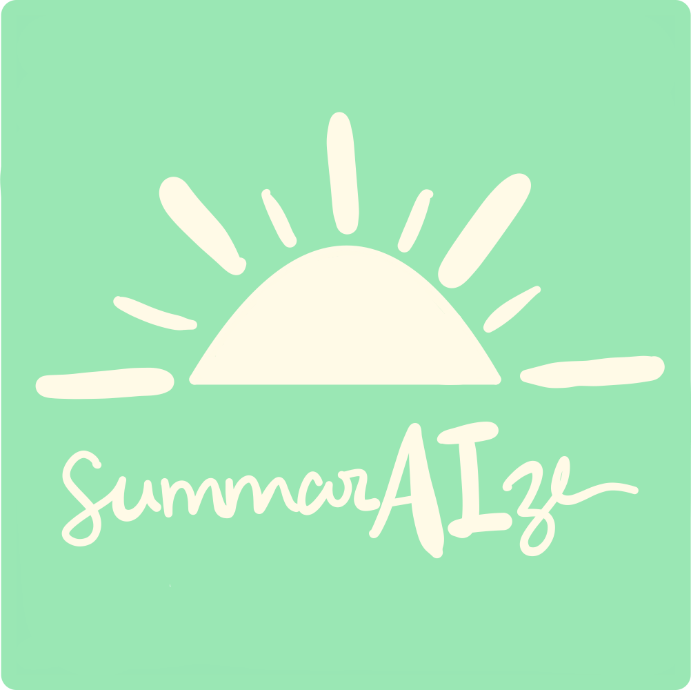
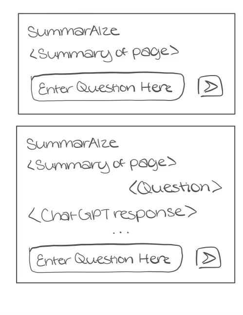
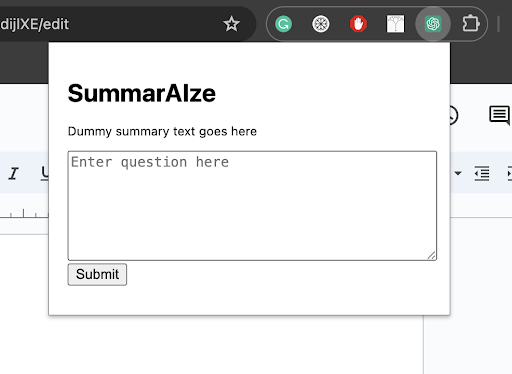

# Progress Report

## 1) Progress Made Thus Far

- Completed static front-end views based on wireframe and added the necessary configuration files to be added to Chrome as an extension (Manifest Version 3).
- Finished rehashing details for the remainder of the project, only implementation left.
- Created a scraper to scrape the text from webpages using Beautiful Soup. 

### Implementation Details:
1. **Web Scraper**: Will use a web scraping library like Beautiful Soup to process the HTML.
2. **Flask Back-end**: Implement a back-end server using Flask that will handle question inputs from the front-end, format requests for the OpenAI API, parse responses, and send them back to the front-end.
3. **Logo**: Designed a user-friendly logo for the extension page.

## 2) Remaining Tasks

- The design and scoping are complete; focus is now on the following implementation details:
    1. Creating a dynamic front-end interface using JavaScript for a chat-based interface within the extension.
        - Display question responses sent from the back-end.
    2. Creating a back-end server in Flask to:
        - Run web scraper to gather relevant text from the HTML of a webpage.
        - Parse question inputs from the front-end.
        - Formulate OpenAI API requests.
        - Handle OpenAI API responses.
        - Send formatted responses back to the front end.

## 3) Challenges/Issues Being Faced

As OpenAI offers a variety of API’s using different models with different costs depending on the number of tokens (100 tokens ~ 75 words) in the requests and responses, we have to decide on the most cost-friendly and effective model for our purposes. This will involve more exploration on the tradeoffs of each model.
For now, we have decided on limiting the length of questions to be < 100 tokens, while also making the length of responses < 200 tokens. We need further testing to make sure that these limitations are optimal.

